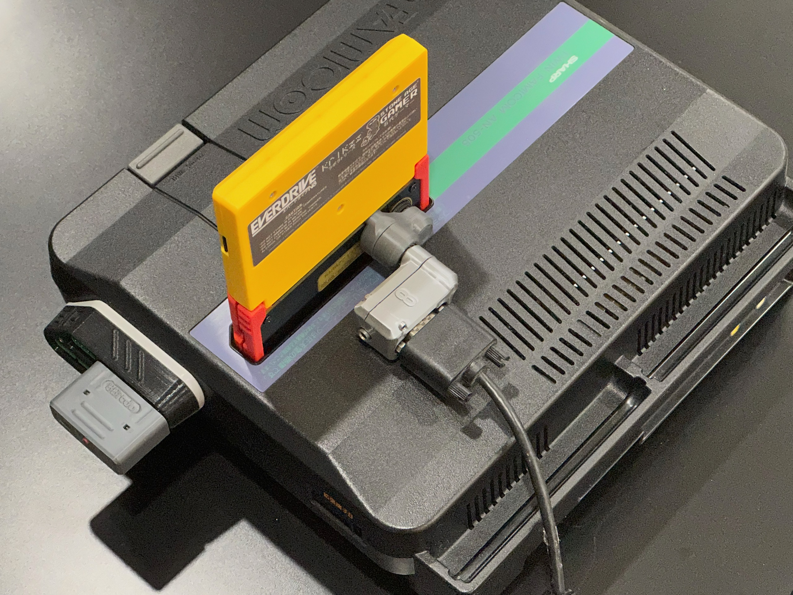

# 8laster Adapter for Krikzz's RGB Blaster

 
Krikzz's [RGB Blaster](https://krikzz.com/our-products/cartridges/rgb-blaster.html) is an innovative way to achieve RGB video output on an unmodded Famicom console.

However, the initial batch of the RGB Blaster had several issues. Krikzz posted some fix, but eventually it will be re-designed and re-released with a new revision.

For the initial batch units, we not only need to apply the [suggested fix](https://twitter.com/krikzz/status/1605908227190833153), but also it seems the video DAC chip [ADV7123](https://www.analog.com/en/products/adv7123.html) is not suitable to work with a 9-pin mini DIN RGBS SCART standard cable. Instead, the 8-pin mini DIN "XRGB Mini" standard, which is also used on the NESRGB and 3DORGB, seems to be a better one. Therefore, I created this 9-pin mini DIN to 8-pin mini DIN adapter called the "8laster".

The 8laster works with my own [8DIN2VGA adapter](https://github.com/jeffqchen/8DIN2VGA) and has almost all the Famicom consoles in consideration (yeah, I don't have the titler.)

 
 
 
 

Of course, it works with any 8-pin mini DIN SCART cable, for example, the one you can purchase with the NESRGB.

## Tech Details

The 8laster adds another set of 150 ohm resistors (R1-R3) to GND on the RGB line, restoring them back to the standard 75 ohm terminated standard.

It offers the option to add the attenuation resistor (R4) on the adapter instead of the RGB Blaster itself. The value 150 plus the original internal 47R is close enough to the suggested 220R (If you insist having the exact value, 173 Ohm would be the proper value).

However, if you've ALREADY applied the suggested fixes, omit R4 and close J1 with a solder blob.

Regarding the suggested fix on the 680R resistor, if you don't feel confident removing the original 680R resistor, you can add a 1.5K Ohm one piggy-backing onto the original one to achieve the intended 470R.

## Parts

- [8laster PCB](https://oshpark.com/projects/GstOPotZ)

- 3D-printed shells
  - [Front](https://github.com/jeffqchen/8laster-Adapter/blob/main/3D%20Print/Front%20Shell.stl)
  - [Back](https://github.com/jeffqchen/8laster-Adapter/blob/main/3D%20Print/Back%20Shell.stl)

- 9 pin Mini DIN Male Plug, Through-Hole Type - [Link](https://github.com/jeffqchen/JeffParts/blob/main/Connectors/Mini%20DIN/9Pin/Through%20Hole/info.md)

- 8-pin mini DIN Female Socket (widely available from various sources)

- M3x8mm screw and nut - [Link](https://github.com/jeffqchen/JeffParts/blob/main/Parts/M2%20M3%20Hex%20Screw%20%26%20Nut/info.md)

- [4x] SMD resistors, Imperial size 0603, 150 Ohm for R1-R4

## 3D Print
Print the shells as indicated in the picture, with support.

## Assembly

First, populate the SMD R1-R4 on the PCB. Short J1 if the suggested fixes were already applied.

Second, slightly spread the shield pins on the two sides of the 8-pin mini DIN female socket. Then insert it **all the way** into the PCB, from the "Outside" side (pins should protrude from the "Inside" side). Solder the shield pins one by one, while making sure the socket remains as flush as possible to the PCB. Then, proceed to solder the rest of the pins.

Then, insert the 8-pin mini DIN male plug from the "Inside" side. Make sure it's flush to the PCB as wel, the solder in the shield pin on top. Proceed to solder the rest of the pins while making sure it's flush to the PCB.

Fit the soldered assembly into the shells and close up with the M3x8mm screw and nut.

Note the nut is on the 8DIN side and the screw is on the 9DIN side.

 

-----
Shield: [![CC BY-SA 4.0][cc-by-sa-shield]][cc-by-sa]

This work is licensed under a
[Creative Commons Attribution-ShareAlike 4.0 International License][cc-by-sa].

[![CC BY-SA 4.0][cc-by-sa-image]][cc-by-sa]

[cc-by-sa]: http://creativecommons.org/licenses/by-sa/4.0/
[cc-by-sa-image]: https://licensebuttons.net/l/by-sa/4.0/88x31.png
[cc-by-sa-shield]: https://img.shields.io/badge/License-CC%20BY--SA%204.0-lightgrey.svg